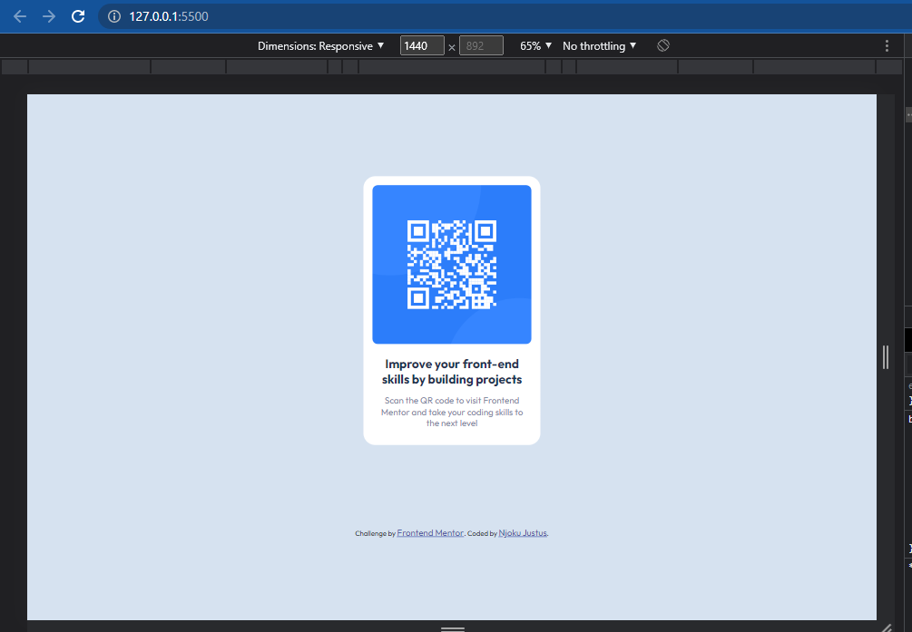

# Frontend Mentor - QR code component solution

This is a solution to the [QR code component challenge on Frontend Mentor](https://www.frontendmentor.io/challenges/qr-code-component-iux_sIO_H). Frontend Mentor challenges help you improve your coding skills by building realistic projects. 

## Table of contents

- [Overview](#overview)
  - [Screenshot](#screenshot)
  - [Links](#links)
- [My process](#my-process)
  - [Built with](#built-with)
  - [What I learned](#what-i-learned)
  - [Continued development](#continued-development)
- [Acknowledgments](#acknowledgments)

## Overview

This is a solution of th Responsive QR code component challenge done by me, Njoku Justus with user email; bertrandjustus@gmail.com. It show clearly the processes done designing the QR code component using pure HTML and CSS with a version control system Git. 

### Screenshot



### Links

- Solution URL: [https://github.com/JustMeks-Unlimited/Responsive-QR-code-component](https://github.com/JustMeks-Unlimited/Responsive-QR-code-component)
- Live Site URL: [https://justmeks-unlimited.github.io/Responsive-QR-code-component/](https://justmeks-unlimited.github.io/Responsive-QR-code-component/)

## My process
-Firstly, I set up my project with Git,
-Worked on my HTML,
-Styled my page using vanilla CSS with responsiveness.


### Built with

- Semantic HTML5 markup
- CSS custom properties
- Flexbox
- Mobile-first workflow

### What I learned

I practically learned how to deal with reponsiveness when creating a design, very important feature to be considered in web development.


```css
.container{
    max-width: 20rem;
    min-height: 23rem;
    padding: 1em;
    background-color: white;
    border-radius: 20px;
    text-align: center;
}
.qr-code{
    width: 100%;
    height: 18rem;
    margin: auto;
}

.qr-code img {
    width: 100%;
    height: 100%;
    border-radius: 10px;
}
```


### Continued development

I like to continue to work with the css responsiveness and the css units and be generally good in styling up my pages.


## Author

- Frontend Mentor - [@JustMeks-Unlimited](https://www.frontendmentor.io/profile/JustMeks-Unlimited)
- Twitter - [@JMeks_Unlimited](https://www.twitter.com/JMeks_Unlimited)


## Acknowledgments

I am grateful to Frontendmentor, for the opportunity and the motivation to the task. The guidance was everything.
